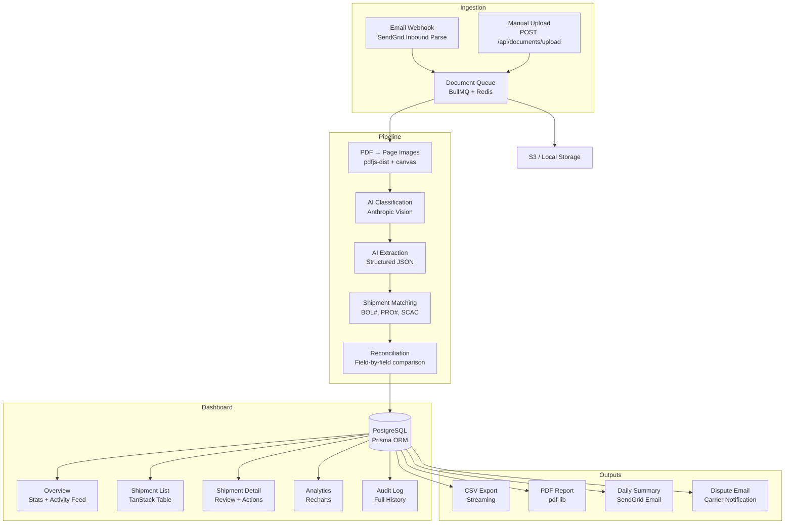

# Architecture

Technical deep dive into Veriload's system design, data model, processing pipeline, and design system.

---

## System Overview



---

## Data Model

Veriload uses 8 Prisma models with PostgreSQL. All tables are organization-scoped for multi-tenancy.

### Entity Relationships

```
Organization ─┬── User (many)
              ├── Document (many)
              ├── Shipment (many)
              └── AuditLog (many)

Shipment ──┬── ShipmentDocument (many) ── Document
           ├── Discrepancy (many)
           └── AuditLog (many)

Document ──┬── ExtractedData (many, latest = active)
           ├── ShipmentDocument (many)
           └── Discrepancy (source + compare)
```

### Models

| Model | Purpose | Key Fields |
|---|---|---|
| **Organization** | Multi-tenant container | `name`, `slug`, `settings` (JSON: tolerances, auto-approve config) |
| **User** | Team member | `email`, `name`, `role` (viewer / analyst / manager / admin) |
| **Document** | Uploaded or ingested file | `status` (pending → processing → processed → failed), `docType`, `docTypeConfidence` |
| **ExtractedData** | AI extraction result | `extractedFields` (JSON), `fieldConfidences`, `extractionModel`, `extractionCostCents` |
| **Shipment** | Freight shipment | `status` (pending → matched → approved / disputed / paid), `discrepancyLevel`, `matchConfidence` |
| **ShipmentDocument** | Many-to-many link | `role` (bol / invoice / rate_con / pod / accessorial) |
| **Discrepancy** | Field-level mismatch | `fieldName`, `sourceValue`, `compareValue`, `varianceAmount`, `severity`, `resolution` |
| **AuditLog** | Immutable activity record | `action`, `details` (JSON), linked to user + shipment |

### Indexes

- `documents(organization_id, status)` — filter docs by processing state
- `documents(organization_id, doc_type)` — filter by classification
- `shipments(organization_id, status)` — shipment queue views
- `shipments(organization_id, discrepancy_level)` — severity filtering
- `shipments(organization_id, bol_number)` — lookup by BOL
- `discrepancies(shipment_id)` — detail page queries
- `audit_log(shipment_id)` — per-shipment history

---

## Pipeline Stages

### 1. PDF Rendering

Documents arrive as PDFs. The `pdf-to-images` module uses `pdfjs-dist` to render each page to a PNG image at configurable DPI (default 220). These images are stored alongside the original and passed to the AI models.

### 2. Classification

A vision prompt sends the first page image to Anthropic Claude and asks it to classify the document as one of: `bol`, `invoice`, `rate_con`, `pod`, `accessorial`, or `unknown`. The model returns a classification with a confidence score.

**Prompt template**: `src/prompts/classify-document.txt`

### 3. Extraction

Based on the classification, a type-specific extraction prompt is used. Each prompt defines the expected JSON schema for that document type:

| Document Type | Prompt | Key Fields |
|---|---|---|
| BOL | `extract-bol.txt` | shipper, consignee, carrier, pickup/delivery dates, pieces, weight |
| Invoice | `extract-invoice.txt` | line items, subtotal, fuel surcharge, accessorials, total amount |
| Rate Con | `extract-rate-con.txt` | contracted rate, origin/destination, weight limits, fuel terms |
| POD | `extract-pod.txt` | delivery confirmation, receiver signature, condition notes |

The extraction response is validated with Zod schemas. Fields that fail validation fall back to heuristic parsing.

### 4. Shipment Matching

The `match-shipment` module attempts to link the newly extracted document to an existing shipment using a weighted scoring algorithm:

1. **Exact BOL# match** — highest weight, instant match if found
2. **PRO# match** — strong signal for invoice matching
3. **Carrier SCAC match** — supporting signal
4. **Reference number overlap** — PO numbers, load numbers
5. **Date proximity** — pickup/delivery date alignment

If no existing shipment matches above a confidence threshold, a new shipment record is created from the extracted data.

### 5. Reconciliation

Once a shipment has multiple documents (e.g., BOL + Invoice), the reconciliation engine compares fields:

- **Numeric fields** (total amount, weight, fuel surcharge): percentage variance against configurable thresholds
- **Exact fields** (carrier name, SCAC, BOL#): normalized string comparison
- **Date fields**: configurable day-window tolerance

Each field comparison produces a `Discrepancy` record with:
- `severity`: green (within tolerance), yellow (marginal), red (material)
- `varianceAmount` and `variancePct` for numeric fields
- The shipment's overall `discrepancyLevel` is the worst severity across all discrepancies

### Auto-Approve

Shipments can be auto-approved when:
- The organization has auto-approve enabled in settings
- Match confidence exceeds the configured threshold (default 90%)
- All discrepancies are green (within tolerance)

---

## AI Prompt Strategy

### Model Selection

- **Classification**: Uses a faster, cheaper model (configurable via `ANTHROPIC_CLASSIFIER_MODEL`)
- **Extraction**: Uses a more capable model for structured data (configurable via `ANTHROPIC_EXTRACTION_MODEL`)
- **Dispute emails**: Uses the extraction model for generating carrier notification drafts

### Prompt Design

Prompts are stored as plain text templates in `src/prompts/`. Each prompt:

1. Defines the role and task clearly
2. Provides the expected JSON output schema
3. Includes field-level instructions for ambiguous cases
4. Specifies confidence scoring criteria
5. Handles edge cases (multi-page documents, poor scan quality)

### Cost Tracking

Every AI call records the model used and estimated cost in cents on the `ExtractedData` record. Cost rates are configurable via environment variables.

---

## Auth System

Veriload uses a header-based session system designed for flexibility:

1. **Request headers**: `x-veriload-user-email` and `x-veriload-org-slug` identify the current user
2. **Session resolution**: `getCurrentAppSession()` looks up the user in the database by email + org slug
3. **Dev mode**: If no matching user exists in development, one is auto-created via `bootstrapDevSession()`
4. **Organization scoping**: Every data access function calls `getScopedOrganizationId()` to enforce tenant isolation
5. **Edge compatibility**: The middleware runs on Edge runtime and only sets security headers (no Node.js-only imports)

### Security Headers

Applied via middleware on all routes:
- `X-Frame-Options: DENY`
- `X-Content-Type-Options: nosniff`
- `Referrer-Policy: strict-origin-when-cross-origin`
- `Permissions-Policy: camera=(), microphone=(), geolocation=()`

---

## Design System

### Color Tokens

All colors are defined as CSS custom properties in `globals.css` with light and dark mode variants:

| Token | Light | Dark | Usage |
|---|---|---|---|
| `--background` | `#f5f0e6` | `#0f172a` | Page background |
| `--foreground` | `#18212d` | `#f1f5f9` | Primary text |
| `--surface` | `#fffdf8` | `#1e293b` | Card backgrounds |
| `--muted` | `#70665b` | `#94a3b8` | Secondary text |
| `--accent` | `#ac4f23` | `#c2703e` | Burnt orange — primary actions |
| `--success` | `#2d7a5b` | `#34d399` | Green — approved, clean |
| `--warning` | `#d28b22` | `#fbbf24` | Amber — review needed |
| `--danger` | `#a33f2f` | `#f87171` | Red — material discrepancy |
| `--border` | `rgba(24,33,45,0.1)` | `rgba(148,163,184,0.15)` | Subtle borders |

### Typography

- **UI font**: Inter (variable weight, loaded via Google Fonts)
- **Data font**: JetBrains Mono (for numbers, codes, monetary values)
- Available via `var(--font-sans)` and `var(--font-code)` CSS variables

### Component Patterns

- **Card**: `rounded-[1.75rem]`, border, surface background, `shadow-card`
- **Button**: `rounded-full`, four variants (primary, secondary, ghost, danger)
- **Badge**: `rounded-full`, tone-based palettes (green, yellow, red, neutral, status-specific)
- **Input**: `rounded-2xl`, accent focus border
- **Animations**: Framer Motion for modals, drawers, progress bars, list transitions

### Layout

- Sidebar: fixed 280px on desktop, hidden on mobile
- Content: max-width 7xl with responsive padding
- Bento-box grid with glassmorphism card styling
- Dark mode: class-based via `ThemeProvider` with localStorage persistence
